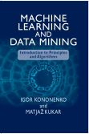

+++
title = 'Igor Kononenko'
draft = false
+++

## Igor Kononenko, Ph. D., Professor

---

**Head of [Laboratory for Cognitive Modeling](../index.html)**  
Department of Artificial Intelligence

&nbsp;

#### [Book: MACHINE LEARNING AND DATA MINING](http://mldmbook.fri.uni-lj.si/)

[Introduction to Principles and Algorithms](http://mldmbook.fri.uni-lj.si/)

[By Igor Kononenko and Matjaž Kukar](http://mldmbook.fri.uni-lj.si/)

### Faculty of Computer and Information Science

---

[University of Ljubljana](http://www.fri.uni-lj.si)  
Večna pot 113, 1000 Ljubljana, Slovenia  
Tel: +386-1-479 8230  
Email: igor.kononenko@fri.uni-lj.si 

### [Band FRIdom](http://www.fridom.si/)

---

|  |     |  |  |
| -------------------------------------------------------------------------------- | ---------------------------------------------------------- | -------------------------------------------------------------------------- | --------------------------------------------------------------------- |
|                        |  |                  |                                                                       |

### Curriculum Vitae:

---

Igor Kononenko received his Ph.D. in 1990 in computer science from the University of Ljubljana, Slovenia. He is a professor at **[Faculty of Computer and Information Science](http://www.fri.uni-lj.si)** in Ljubljana (courses: **[Algorithms and Data Structures1](slo/pedagosko.htm#PA)**, **[Machine Learning](slo/pedagosko.htm#SUMAGBOL)**, **[Artificial Intelligence](slo/pedagosko.htm#UI)**), and the head of **[Laboratory for Cognitive Modeling](../index.html)**. His research interests include artificial intelligence, machine learning, neural networks, and cognitive modeling. He is the (co)author of about 225 **[papers](slo/bibliografija.htm)** and 13 textbooks (two in English). He is a member of the editorial board of Applied Intelligence Journal and **[Informatica Journal](http://www.informatica.si/)**. He was also twice a chair of the program committee of the International Cognitive Conference in Ljubljana and once in Kamnik. Besides artificial intelligence, he is also interested in natural intelligence, the relationship between science and spirituality, and spiritual wisdom.
