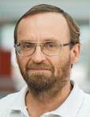
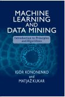
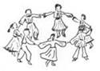

+++
title = 'Igor Kononenko'
draft = false
+++

## Igor Kononenko, Ph. D., Profesor

---

**Vodja [Laboratorija za kognitivno modeliranje](../index.html)**  
Oddelek za umetno inteligenco

&nbsp;

#### [Knjiga: STROJNO UČENJE IN RUDARJENJE PODATKOV](http://mldmbook.fri.uni-lj.si/)

[Uvod v principe in algoritme](http://mldmbook.fri.uni-lj.si/)

[Igor Kononenko in Matjaž Kukar](http://mldmbook.fri.uni-lj.si/)

### Fakulteta za računalništvo in informatiko

---

[Univerza v Ljubljani](http://www.fri.uni-lj.si)  
Večna pot 113, 1000 Ljubljana, Slovenija  
Tel: +386-1-479 8230  
Email: igor.kononenko@fri.uni-lj.si 

### [Skupina FRIdom](http://www.fridom.si/)

---

|  |     |  |  |
| ----------------------------------------------------------------------------- | ---------------------------------------------------------- | -------------------------------------------------------------------------- | --------------------------------------------------------------------- |
|                   |  |                  |                                                                       |

### Življenjepis:

---

Igor Kononenko je leta 1990 doktoriral iz računalništva na Univerzi v Ljubljani, Slovenija. Je profesor na **[Fakulteti za računalništvo in informatiko](http://www.fri.uni-lj.si)** v Ljubljani (predmeti: **[Algoritmi in podatkovne strukture 1](slo/pedagosko.htm#PA)**, **[Strojno učenje](slo/pedagosko.htm#SUMAGBOL)**, **[Umetna inteligenca](slo/pedagosko.htm#UI)**) ter vodja **[Laboratorija za kognitivno modeliranje](../index.html)**. Njegova raziskovalna področja vključujejo umetno inteligenco, strojno učenje, nevronske mreže in kognitivno modeliranje. Je (so)avtor približno 225 **[člankov](slo/bibliografija.htm)** in 13 učbenikov (dva v angleščini). Je član uredniškega odbora revije Applied Intelligence Journal in **[Informatica Journal](http://www.informatica.si/)**. Dvakrat je bil predsednik programskega odbora mednarodne konference Cognitive Conference v Ljubljani in enkrat v Kamniku. Poleg umetne inteligence ga zanimajo tudi naravna inteligenca, odnos med znanostjo in duhovnostjo ter duhovna modrost.
